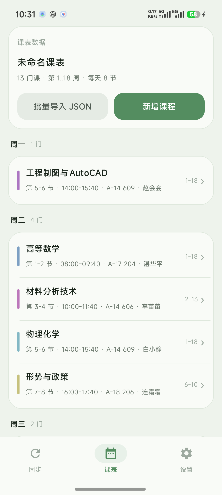

# 课程表 · OPPO Watch X2

把手表当课程表用。手机 App 里粘一份 AI 生成的 JSON，点一下推到手表，
之后两块屏上就是同一份课表。

- **`CourseTableWatch/`** 手表端 · 装在 OPPO Watch X2 上（ColorOS Watch，标准 Android 11，不是 Wear OS）。
- **`CourseTablePhone/`** 手机端 · 用来导入课表和改所有设置，改完推给手表。

没有账号，没有服务端，**不联网**。课表只在你自己这两台设备之间通过蓝牙走。



## 下载安装

到 **[Releases](https://github.com/xiaogon12/OPPOCourseTable/releases/latest)** 下载：

| 文件 | 装到哪 | 怎么装 |
| --- | --- | --- |
| `app-release.apk` | 手机（Android 8.0 以上） | 传进手机，**点开就装**（提示「未知来源」时允许一次） |
| `CourseTableWatch.apk` | 手表（OPPO Watch X2） | 手表上没有能点开 APK 的安装界面。用数据线连电脑，电脑装好 adb 工具；手表进「设置 → 关于手表 → 版本信息」，连续点击版本号开启开发者，再在开发者选项里打开 USB 调试，手表用较好的数据线连接台式电脑的橙色插口或笔记本的任意插口，选择传输文件，可能会有弹窗，点允许，找到apk文件地址；然后 `adb install ＼...＼...＼CourseTableWatch.apk` （不会请询问AI）|

手表上也能拿到下载地址：**手表 →「我的」→「从手机接收」→「显示下载二维码（全屏）」**，用手机扫一下。

## 怎么用

1. 手机打开 App →「课表」→「批量导入 JSON」→ **复制提示词**
2. 把提示词和你的课表（教务系统复制的文字、截图转文字都行）一起丢给任意 AI，拿回一段 JSON
3. 粘回 App，确认预览没问题 →「覆盖应用」
4. 手表 →「我的」→「从手机接收」→「开始等待手机推送」
   手机 →「同步」→「推送到手表」

课表和**全部设置**（学期周数、作息时间、课前提醒、配色）都在手机端改，
推一次全部同步过去，不用在手表上戳。

## 自己编译

```bash
# 手机端（JDK 17+ 和 Android SDK）
cd CourseTablePhone
./gradlew :app:assembleRelease

# 手表端（只要 Android SDK，约 10 秒）
cd CourseTableWatch
python tools/build.py --install
```

> 两头都请构建 release，不要用 debug 包。

## 感谢 AI，让什么都不懂的人也可以做应用

做这个项目本身是身为大学生，课程表非常重要，所以开发这个项目。

## 声明

- **不联网、不收集任何信息、不上传任何数据。** 手机端要蓝牙权限只是为了和手表直连传 JSON，
  没有统计 SDK、没有崩溃上报、没有广告。
- 个人项目，**和 OPPO / ColorOS 官方无关**，也不是 Wear OS 应用。
  只在 OPPO Watch X2（OWW251，ColorOS Watch 16.0.0）上实测过。
- 作者 **xiaogon12**，仓库 <https://github.com/xiaogon12/OPPOCourseTable>。
  软件里带着作者的署名，请不要删掉它。

## 许可 · CC BY-NC-SA 4.0

**署名—非商业性使用—相同方式共享 4.0 国际**（Creative Commons Attribution-NonCommercial-ShareAlike 4.0 International）。

| | |
| --- | --- |
| ✅ 可以 | 免费用；随意改；原样或改版后再发布；在自己学校 / 社团内部分享 |
| ❌ 不可以 | 卖钱；任何盈利用途（含广告变现、付费下载、捆绑销售）；去掉作者署名当成自己的作品；改版后换成闭源或商业许可 |
| 必须 | 保留作者署名与本仓库地址；改版发布必须沿用本协议 |

许可全文见仓库根目录 [`LICENSE`](LICENSE)。
中文摘要 <https://creativecommons.org/licenses/by-nc-sa/4.0/deed.zh>
